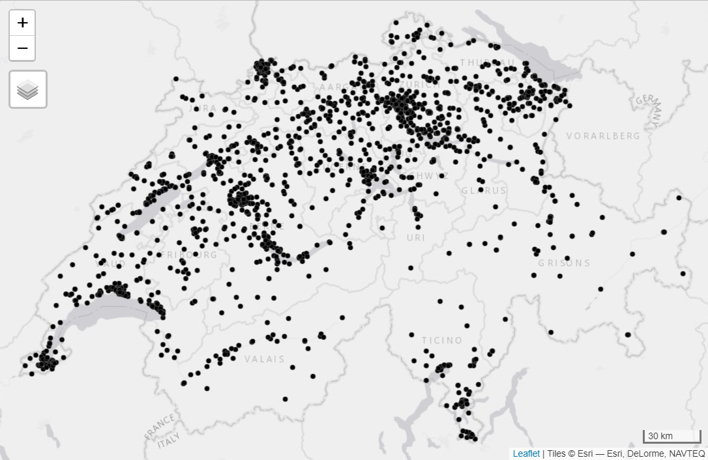

# ISPM_SOMED-geo

Geocoding data on care facilities in Switzerland. 

Using [BAG data](https://www.bag.admin.ch/bag/de/home/zahlen-und-statistiken/zahlen-fakten-zu-pflegeheimen/kennzahlen.html) on [Kennzahlen der Schweizer Pflegeheime 2018 Flat File (Excel, deutsch, 1MB)](https://somed.bagapps.ch/data/download/2018_Flat_File_de.xlsx?v=1592405920).

([opendata.swiss link](https://opendata.swiss/de/dataset/kennzahlen-der-schweizer-pflegeheime))

This file should present:  

> Die Zahlen basieren auf den definitiven Daten 2018

First round of geocoding using [map.geo.admin.ch](https://map.geo.admin.ch/); second round with Google (via `ggmap` package) plus manual corrections.

(CC BY-NC-SA 4.0)
